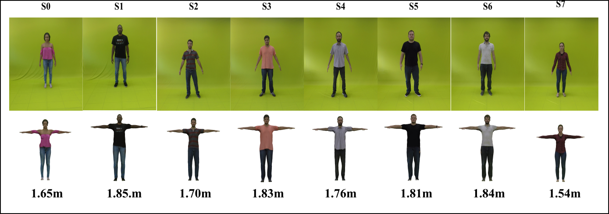
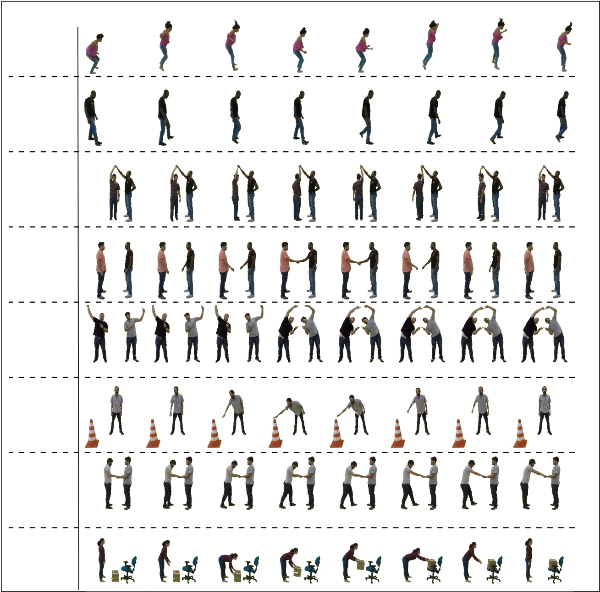

# A Shape-Aware Retargeting Approach to Transfer Human Motion and Appearance in Monocular Videos


## Table of Contents
  * [Description](#description)
  * [Installation](#installation)
  * [Dataset](#dataset)
  * [Citation](#citation)

## Description

## Installation
* See the README in the subfolders retargeting and model-deformation-render

## Dataset ([download](https://www.verlab.dcc.ufmg.br/MotionTransfer/MotionTransfer-dataset.tar.gz))

There are 8 actors (S0-S7) in the dataset:



Our dataset is divided into two sets: *train* and *test*. A description of each set is defined below:

### **Train**

Each actor has 4 types of data: *4-min*; *8-views*; *A-pose* and *dance*. 

**4-min**: 4 minutes of random movements performed by each actor. The directory contains a folder called *images* with the .jpg images, a text file (person.txt) with the heigth and smpl parameters, and a consensus of the smpl shape (.pkl).

**8-views**: This folder contains 8-views from each actor with 45 degree variation between each pose. It has three aditional folders: segmentations, with 0/1 map of the person; semantic_label, with each pixel labeled semanticaly; and smpl_pose with the SPIN pose estimations.

**A-pose**: Original 360º degree movements used to generate 8-views folder.

**dance**: Random dance movements performed by each actor. 

```
train
└───S0
└───S1
|   ...
└───S7    
│   └─── 4-min
|       | person.txt
|       | smpl_consensus_shape.pkl
|       └─── images
|   |        
|   └─── 8-views
|       | person.txt
|       | smpl_consensus_shape.pkl
|       └─── images
|       └─── segmentations
|       └─── semantic_label
|       └─── smpl_pose   
|   |
|   └─── A-pose
|       | person.txt
|       | smpl_consensus_shape.pkl
|       └─── images
|   |
|   └─── dance
|       | person.txt
|       | smpl_consensus_shape.pkl
|       └─── images
```

### **Test**

For the test set, there is 8 movements perfomed by each actor:

- box
- cone
- fusion dance
- jump
- pull down
- shake hands
- spinning
- walk



On each folder there is a text file (person.txt) with the height and smpl parameters along with the movement 3D restrictions (in some, also 2D). There is also three folders: images, with rgb frames from the scene; openpose, with the actors 2D poses; and smpl_pose, with the correspondent smpl estimation.

```
test
└───S0
└───S1
|   ...
└───S7 
    └─── box
    └─── cone
    | ...
    └─── walk
          | person.txt
          | restrictions-3D.json
          └─── images
          └─── openpose
          └─── smpl_pose
```

### Citation
If you use this code for your research, please consider citing:
```
@article{gomes2021,
  title={A Shape-Aware Retargeting Approach to Transfer Human
Motion and Appearance in Monocular Videos},
  author = {Thiago L. Gomes and Renato Martins and Joao Ferreira and Rafael Azevedo and Guilherme Torres and Erickson R. Nascimento},
  booktitle={International Journal of Computer Vision (IJCV)},
  year={2021}
}
```


