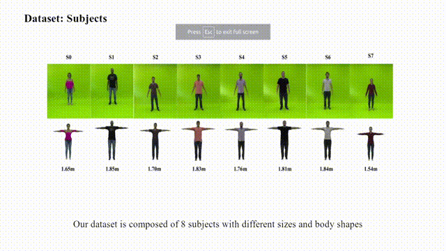

## <b> Shape-Aware Human Retargeting in Monocular Videos</b> <br>[[Project Page]](https://verlab.github.io/ShapeAwareHumanRetargeting_IJCV_2021/) [[Paper]](https://arxiv.org/abs/2103.15596)

Python and TensorFlow code implementation of the shape-aware human motion and appearance transference between monocular videos. The project webpage of the paper is https://verlab.github.io/ShapeAwareHumanRetargeting_IJCV_2021/

  

### Introduction

This repository contains the original implementation of the human retargeting approach and dataset of the [paper](https://arxiv.org/abs/2103.15596): **"A shape-aware retargeting approach to transfer human motion and appearance in monocular videos"**. The method is composed of four main components and synthesizes new videos of people in a different context where they were initially recorded. Differently from recent human neural rendering methods, our approach takes into account jointly body shape, appearance and motion constraints in the transfer.

Please cite this code and paper in your publications if it helps your research:
```
@article{gomes2021,
	title={A Shape-Aware Retargeting Approach to Transfer Human
		Motion and Appearance in Monocular Videos},
	author = {Thiago L. Gomes and Renato Martins and Joao Ferreira and Rafael Azevedo and Guilherme Torres and Erickson R. Nascimento},
	booktitle={International Journal of Computer Vision (IJCV)},
	year={2021}
}
```

## Setup and Installation

We provide install and running examples for the main components of the approach. For the motion reconstruction and retargeting, please follow the instructions given in [README_Retargeting.md](retargeting/README.md).

For the texture extraction, body geometry refinement and the image-based rendering into the background of the source video, please follow the instructions provided in [README_DeformationRender.md](model-deformation-render/README.md).

## Human Retargeting Dataset 

We created a dataset with several paired human motion sequences from different actors and annotated motion retargeting constraints. The dataset contains 8 actors (S0-S7) performing eight different actions. Link to [download](https://www.verlab.dcc.ufmg.br/MotionTransfer/MotionTransfer-dataset.tar.gz)


The dataset sequences are divided into two sets: **training** and **test**.

### **Training Set**

For each actor we provide 4 types of data: *4-min* videos; *8-views*; *A-pose* and *dance*. 

- **4-min**: 4 minutes of random movements performed by each actor. The directory contains a folder called *images* with the .jpg images, a text file (person.txt) with the heigth and smpl parameters, and a consensus of the smpl shape (.pkl).

- **8-views**: This folder contains 8-views from each actor with 45 degree variation between each pose. It has three additional folders: *segmentations* with binary masks of the actors; *semantic_label* containing the human body parts labeled semantically; and *smpl_pose* with the SPIN pose estimations.

- **A-pose**: Original 360 degree movements used to build the 8-views folder.

- **dance**: Random dance movements performed by each actor. 

```
train
└───S0
└───S1
|   ...
└───S7    
│   └─── 4-min
|       | person.txt
|       | smpl_consensus_shape.pkl
|       └─── images
|   |        
|   └─── 8-views
|       | person.txt
|       | smpl_consensus_shape.pkl
|       └─── images
|       └─── segmentations
|       └─── semantic_label
|       └─── smpl_pose   
|   |
|   └─── A-pose
|       | person.txt
|       | smpl_consensus_shape.pkl
|       └─── images
|   |
|   └─── dance
|       | person.txt
|       | smpl_consensus_shape.pkl
|       └─── images
```

### **Test Set**

For the test set, we provide 8 movements performed by each actor:

- box
- cone
- fusion dance
- jump
- pull down
- shake hands
- spinning
- walk


Each movement folder contains a text file (person.txt) with the height and SPML parameters, as well as the annotated 2D and 3D motion restrictions. There is also three sub-folders containing: i) **images** from the scene; ii) **openpose** with the actors 2D poses from OpenPose/SPIN; and iii) **smpl_pose** with the corresponding SMPL model estimation.

```
test
└───S0
└───S1
|   ...
└───S7 
    └─── box
    └─── cone
    | ...
    └─── walk
          | person.txt
          | restrictions-3D.json
          └─── images
          └─── openpose
          └─── smpl_pose
```

### License \& Disclaimer
This is research code, expect that it can change and any fitness for a particular purpose is disclaimed.
This software is under GNU General Public License Version 3 ([GPLv3](LICENSE)).


<br/>
